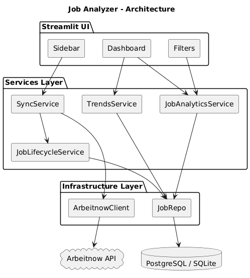
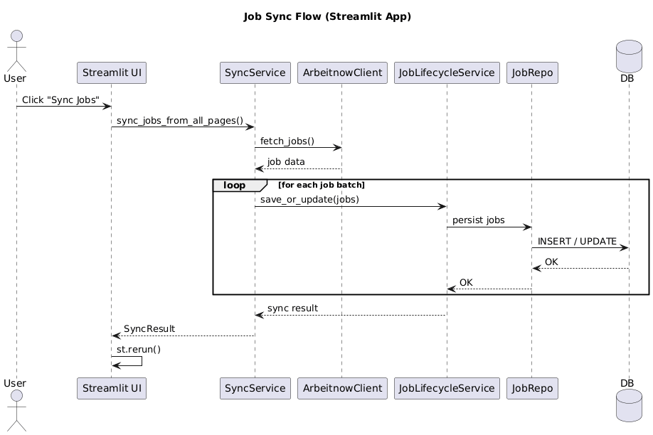

# Job Search Analyzer

A data-driven job market analytics application built with Streamlit.  
The project collects job listings from an external API, stores them in a database, and provides interactive analytics, filtering, and trend visualization.

---

## 📊 Overview

Job Search Analyzer is a lightweight analytics tool designed to explore job market trends, filter job listings, and analyze hiring patterns over time.

Unlike traditional web applications, this project is built entirely on Streamlit, meaning the UI and backend logic run within the same Python runtime. Business logic is separated into service and repository layers to maintain clean architecture and testability.

---

## ✨ Features

- 🔄 Automatic job synchronization from external API (Arbeitnow)
- 📊 Interactive analytics dashboard
- 🔍 Advanced filtering (location, remote, keyword search)
- 📈 Daily, weekly, and monthly job trends
- 🏢 Company and location insights
- ⚡ Cached data loading for improved performance
- 🧪 Test coverage with pytest
- 🧱 Clean layered architecture (UI / Service / Repository)

---

## 🛠️ Tech Stack

- Streamlit – UI framework
- Pandas – data processing and analytics
- SQLAlchemy – ORM
- PostgreSQL / SQLite – database
- Requests – external API integration
- Pytest – testing framework
- Loguru – logging

---


## 🚀 Installation

Clone the repository:
```
git clone <repo-url>
cd job-search-analyzer
```
Create virtual environment:
```
python -m venv venv
source venv/bin/activate  (Mac/Linux)
venv\Scripts\activate     (Windows)
```
Install dependencies:
```
pip install -r requirements.txt
```
Set environment variables:
```
ENV=dev
DATABASE_URL=your_database_url
ARBEITNOW_API_URL=https://www.arbeitnow.com/api/job-board-api
```
Run the application:
```
streamlit run streamlit_app.py
```
---

## 📌 Usage

After launching the app:

- Open the sidebar to sync latest jobs
- Use filters to narrow down results
- Explore job analytics in the dashboard
- Switch between daily, weekly, and monthly trends tabs

Example workflow:

- Click "Sync Jobs" to fetch latest data
- Apply filters (location, remote, keyword)
- View updated analytics and trends instantly

---

## 🧱 Project Structure
```
job_analyzer/
├── ui/                  # Streamlit UI components
├── services/            # Business logic layer
├── infrastructure/      # DB and external API clients
├── models/              # DTOs and schemas
├── core/                # Interfaces and config
├── bootstrap.py         # Dependency setup
streamlit_app.py         # Application entry point
```
---

## 🧪 Testing

Run tests with:
```
pytest --cov=job_analyzer --cov-report=term-missing
```
Current test coverage focuses on:
- Service layer logic
- Repository queries
- UI rendering behavior

---


## 🏗️ Architecture

The application follows a layered architecture:



UI (Streamlit)
→ Service Layer (business logic)
→ Infrastructure Layer  (data access and external APIs)

This separation ensures:
- Clear responsibility boundaries
- Easier testing and maintenance
- Ability to migrate to a backend API in the future

---

## 🧠 System Design

### Overview

This application is designed as a lightweight analytics system built on top of Streamlit. Unlike traditional web applications, it does not use a separate frontend/backend split with REST APIs. Instead, Streamlit executes Python code directly and renders the UI based on the execution result.

### 🔄 Data Flow (Sync Process)



### Architecture Decisions

#### 1. Layered Design

The system is divided into three logical layers:

- UI Layer (Streamlit)
- Service Layer (business logic)
- Infrastructure Layer (data access and external APIs)

This separation ensures:
- Clear responsibility boundaries
- Easier testing and maintenance
- Ability to migrate to a backend API in the future

---

#### 2. Service-Oriented Logic

Business logic is encapsulated in service classes:

- SyncService → handles data ingestion and synchronization
- JobAnalyticsService → handles data transformation and analytics
- TrendsService → computes time-based statistics
- JobLifecycleService → manages persistence rules

Services are independent of UI and database implementation details.

---

#### 3. Repository Pattern

All database access is abstracted via repository interfaces.

This allows:
- Switching between SQLite and PostgreSQL without changing business logic
- Easier unit testing via mocking repositories
- Centralized data access logic

---

#### 4. External API Integration

Job data is retrieved from the Arbeitnow API via a dedicated client.
The SyncService orchestrates the ingestion process:

API → SyncService → LifecycleService → Repository → Database

---

### Why Streamlit?

Streamlit was chosen to:
- Rapidly prototype data-driven UI
- Avoid frontend complexity (React/JS)
- Focus on Python-based analytics logic
- Enable fast iteration during development

---

### Future Evolution

This architecture can be easily migrated into a full backend system:

- Streamlit → React frontend
- Services → FastAPI backend
- Repository layer remains unchanged

This makes the system naturally extensible toward a production-grade architecture.

---

## 📈 Future Improvements

- Skill extraction from job descriptions
- Advanced trend forecasting
- User authentication and saved searches
- Migration to FastAPI backend architecture
- Deployment to cloud environment

---

## 🤝 Contributing

Contributions are welcome.

1. Fork the repository
2. Create a feature branch (feature/your-feature)
3. Commit changes
4. Open a pull request

---

## 📄 License

This project is for educational purposes.